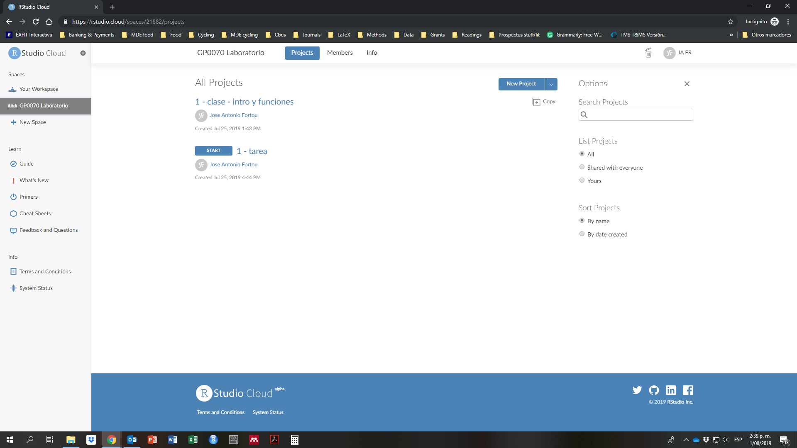
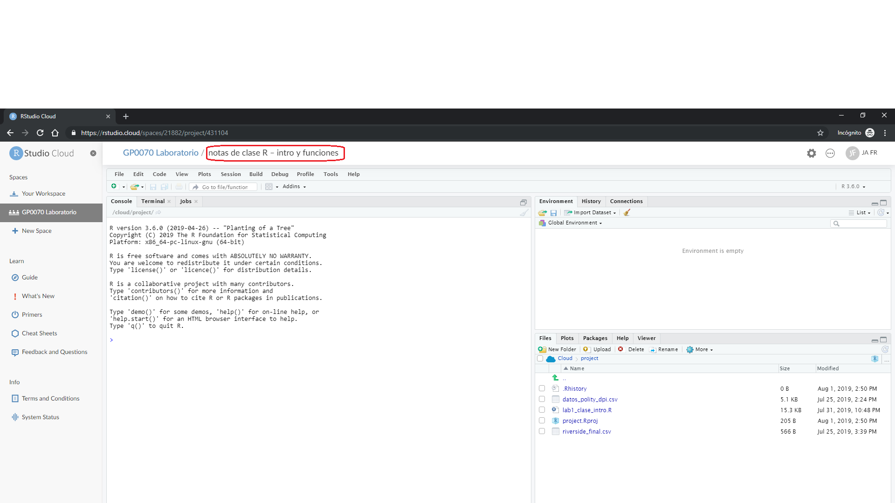

# (PART) Introducción a R y RStudio {-}

# Introducción {#intro}

## Resumen

En este capítulo, introducimos R, RStudio y RStudio Cloud, una serie de  herramientas para realizar análisis estadístico. Discutimos la diferencia entre trabajar con *scripts* de R (archivos `.R`) y con documentos RMarkdown (`.Rmd`), así como la utilidad de traer librerías adicionales para expandir la funcionalidad de R. Finalmente, presentamos una serie de problemas frecuentes al usar R, especialmente al inicio del proceso de aprendizaje.

- Principales conceptos: R; RStudio; RStudio Cloud; script; RMarkdown; directorio; librería.

## Hello, world!

```{r}
print("Hello, world!")
```

¡Bienvenidos a R y RStudio! [R](https://www.r-project.org/) es un lenguaje y un programa estadístico. Es de uso libre y cuenta con grandes capacidades para hacer análisis político. En el nivel más básico, R es una calculadora. Puede realizar operaciones y aplicar funciones, como por ejemplo, una multiplicación. Simplemente ingresamos una operación con operadores matemáticos (por ejemplo, multiplicación `*`) en la consola del programa, ejecutamos el código con la tecla `Enter` y R nos arroja el resultado.

```{r}
6*7
```

Usando R, también podemos crear una secuencia de números del 1 al 100, utilizando funciones que el lenguaje reconoce y "lee" correctamente (aquí, la función es `seq()`):

```{r}
seq(from = 1, to = 100, by = 1)
```

En ocasiones, si queremos que el resultado de una operación o una línea de código permanezca, convertimos los resultados de estas operaciones en objetos de R al asignarles un nombre con el operador de asignación `<-`. Por ejemplo, podemos guardar la secuencia anterior creando un objeto llamado `secuencia_nums`:

```{r}
secuencia_nums <- seq(from = 1, to = 100, by = 1)
```

A su vez, estos objetos son sujetos de ser transformados con funciones que les aplican operaciones. Aquí, encontramos la media del objeto `secuencia_nums` usando la función `mean()`:

```{r}
mean(secuencia_nums)
```

Con elementos tan sencillos como estos y otros que veremos más adelante, eventualmente exploraremos datos y construiremos modelos estadísticos. En esta breve introducción[^1], discutimos cómo trabajar con R usando RStudio y su versión web, RStudio Cloud. Nuestro principal objetivo es tener la bases para, más adelante, hacer análisis de datos exploratorio (con gráficas y tablas) y análisis estadístico utilizando regresiones.  

[^1]: El primer borrador de este capítulo tomaba elementos prestados de [Quick Tips for R and RMarkdown](https://drive.google.com/file/d/1W8NxN-lfHvDHHJWMBYd8qXQUqefP6Ek_/view).

## RStudio

Primero, hay que entender cómo vamos a usar R a través de RStudio. [RStudio](https://rstudio.com/) es una IDE (un *integrated development environment* o entorno de desarrollo integrado) que funciona como una interfaz gráfica de usuario o GUI (*graphical user interface*) para facilitar el uso del lenguaje R y sus capacidades. RStudio Cloud es la versión web de RStudio, con muchas de las mismas capacidades.

Los elementos centrales del programa RStudio -además de la barra de menús en la parte superior, que comparte con muchos otros programas de computador- son cuatro paneles que vemos en la ventana principal. El flujo de trabajo en RStudio sigue lo que hacemos en estos paneles:

1. Escribimos código, seudo-código, comentarios y hasta texto en el panel del script (archivo `.R`) o RMarkdown (archivo `.Rmd`) (por defecto, el panel superior-izquierdo). En una sesión nueva de RStudio, este panel puede no aparecer. Lo activamos creando un archivo tipo R script o RMarkdown nuevo en el menú `File` o abriendo un archivo `.R` o `.Rmd` ya existente.
2. Ejecutamos (corremos, compilamos...) el código en la consola (panel inferior-izquierdo). El símbolo `>` y una línea vacía nos indica que R está listo para ejecutar un comando. En la consola además vemos los resultados de nuestro código. Aquí también creamos objetos de R nuevos al asignarle nombre al resultado de una operación. Ejecutamos código de una de las siguientes maneras:
  - Escribimos código directamente en la consola y presionamos la tecla `Enter`.
  - Copiamos código (de un script, un documento RMarkdown o de otra fuente), lo pegamos en la consola y presionamos `Enter`.
  - Corremos directamente desde el script o RMarkdown usando `Ctrl + Enter` (corre un bloque continuo de código) o seleccionando el código con el cursor y luego usando `Ctrl + Enter` (corre solo lo seleccionado).
  - Hacemos clic en el botón `Run`  del panel del script o RMarkdown, ejecutando un bloque continuo de código.
3. Frecuentemente creamos *objetos* de R tales como bases de datos, variables, tablas, resultados, etc. Estos aparecen en el `Environment` o ambiente de la sesión de RStudio (panel superior-derecho). Hacemos esto ejecutando código en la consola o usando menús y asignándole un nombre al resultado; por ejemplo, una base de datos se puede cargar con código o con el menú `File > Import Dataset`. Todos los objetos que están en el ambiente quedan disponibles para usarse en el código. Podemos borrar *todos* los elementos haciendo clic en `Clear` . También desaparecen cuando cerramos la sesión, pero podemos guardarlos como archivos para usar después. Así mismo, el script o RMarkdown nos permite volver a construir objetos que hemos eliminado o que han desaparecido porque abrimos una nueva sesión de RStudio.
4. Consultamos archivos y directorios (carpetas), gráficas creadas, librerías cargadas o manuales de ayuda integrados en RStudio (panel inferior-derecho).

La siguiente captura de pantalla muestra cómo están organizados estos elementos en RStudio Cloud, la versión web de RStudio - estas dos versiones son prácticamente idénticas. El orden de los paneles puede configurarse en el menú `Tools` (personalmente, ubico el script y el `Environment` a la izquierda y la consola y las gráficas a la derecha), pero la organización que trae RStudio por defecto funciona bien.


## RStudio Cloud

Recapitulando: R es un lenguaje de programación estadística y RStudio es una IDE o GUI que facilita el uso de R. [RStudio Cloud](https://rstudio.cloud) es una plataforma web que permite acceder a casi toda la funcionalidad de R y RStudio, pero desde un navegador web. Esto significa que no hay que descargar e instalar programas al computador de escritorio. Igualmente, permite compartir fácilmente código y resultados con colegas, compañeros, profesores y estudiantes. En términos de funcionalidad y "look", RStudio Cloud es casi idéntico a RStudio en el escritorio. 

Para utilizar RStudio Cloud, deben crear una cuenta gratis en el [sitio web](https://rstudio.cloud). Luego, deben crear un nuevo espacio de trabajo o Workspace. Pueden agregar invitados --sus compañeros de trabajo-- a ese espacio de trabajo en la pestaña members. Después, pueden crear proyectos para tomar notas, para realizar los talleres o realizar los análisis para sus proyectos de investigación. Sin embargo, pese a estar "en la nube", dos usuarios **no** pueden abrir el mismo proyecto de RStudio Cloud al mismo tiempo.

<!-- ### Para abrir RStudio Cloud -->

<!-- 1. Seguir el link en la invitación al espacio de trabajo ("Workspace") compartido llamado **GP0070 Laboratorio** en RStudio Cloud. La invitación con el link debe estar en su correo institucional de EAFIT. Revisar la bandeja de correo no deseado si es necesario. -->

<!-- 2. Entrar a RStudio Cloud usando el correo de EAFIT como usuario y la contraseña elegida. En caso de no haberlo hecho previamente, crear usuario y contraseña. Recuerde utilizar su email de EAFIT como usuario. -->

<!-- 3. Si ya ha aceptado la invitación al espacio compartido y ya tiene su usuario y contraseña, ingresar directamente vía https://rstudio.cloud. Si no entra directamente al espacio compartido, seleccionar haciendo clic en **GP0070 Laboratorio** en la barra de la izquierda. -->

<!--  -->

<!-- ### Para trabajar en clase  -->

<!-- Buena parte del curso de Laboratorio para Ciencias Políticas se desarrolla en esta plataforma. Para seguir las presentaciones en clase y tomar notas en RStudio Cloud: -->

<!-- 1. Iniciar sesión en RStudio Cloud. Hacer clic en `Copy` en la página principal del espacio frente al nombre del proyecto que contiene las notas de clase (por ejemplo, "Clase 1 – Intro a R") y dar clic en `Ok` para crear una copia personal del proyecto. Esto crea la copia y la abre automáticamente. La copia contiene todos los archivos incluidos en el proyecto original. Los cambios realizados en esta copia no afectan el original, así que puede ser modificada con tranquilidad. Sin embargo, los cambios en el original no se ven reflejados en copias creadas anteriormente. -->

<!--  -->

<!-- 2. Cambiar el nombre de la copia del proyecto haciendo clic en la parte superior de la página donde se encuentra el nombre original del proyecto, justo a la derecha de **GP0070 Laboratorio**. Usar un nombre único y que permita identificar el proyecto fácilmente; por ejemplo, "notas de clase R – intro y funciones". -->

<!--  -->

<!-- 3. Hacer clic en el link a la página principal del espacio (en la barra izquierda o en la parte superior: **GP0070 Laboratorio**), hacer clic en `Move` frente al nombre de la copia y seleccionar **Your Workspace** para mover la copia del proyecto a su espacio personal. -->

<!--  -->

<!-- 4. Hacer clic en **Your Workspace** en la barra de la izquierda y buscar la copia del proyecto en su espacio personal. Abrir el proyecto haciendo clic en el nombre. Ya puede empezar a tomar notas y cambiar el código. -->

<!--  -->

<!-- ### Talleres en RStudio Cloud -->

<!-- Los talleres restante los van a realizar a través de RStudio Cloud. Estos son proyectos marcados claramente como tareas, tanto en el nombre (por ejemplo, "Taller 1 - Intro a R") como en la interfaz de RStudio Cloud (vienen marcados como "Assignment"). -->

<!-- 1. Iniciar sesión en RStudio Cloud e ir a la página principal del espacio compartido ("Workspace") del curso haciendo clic en **GP0070 Laboratorio** en la barra izquierda. -->

<!-- 2. Hacer clic en `Start` en el proyecto del taller que desea realizar (marcado como "Assignment). Esto abre el taller y automáticamente crea una copia personal para el estudiante que el instructor puede ver también. -->

<!--  -->

<!-- 3. Cambiar el nombre del proyecto de la tarea a algo como "Tarea – Número de la tarea – Nombre del estudiante". Es importante incluir el número del taller en el nombre del proyecto/taller. El proyecto ya incluye un script con los ejercicios a resolver, así como los archivos de datos y librerías para resolver los ejercicios. -->

<!--  -->

<!-- 4. Importante: *no* deben mover los proyectos de tarea a sus espacios personales (**Your Workspace**). Esto impide que puedan ser vistos por el instructor y, por tanto, no podrán ser evaluados. Pueden hacer copias en sus espacio personal, por supuesto, pero debe dejar una en el espacio compartido **GP0070 Laboratorio**. -->

<!-- 5. Hacer clic en el archivo que contiene el archivo con las pautas y ejercicios (archivo RMarkdown con extensión `.Rmd` ) para abrirlo y empezar a resolverlos. Deben utilizar este archivo para escribir el código que resuelva los ejercicios. Si no abre inmediatamente, el archivo `.Rmd` se encuentra en el cuadrante inferior derecho del proyecto, bajo la pestaña `Files`, con un nombre que lo identifica claramente como un taller. Es posible agregar comentarios pertinentes o escribir texto explicativo o de apoyo. Es necesario incluir el nombre al principio del documento (en el encabezado). Hablaremos más sobre RMarkdown en la siguiente sección. -->

<!--  -->

## Scripts y RMarkdown

Todo proyecto en R empieza con un documento que contiene el código que vamos a ejecutar. Estos documentos son principalmente de dos tipos: R script o RMarkdown.

### Rscripts

Un script de R (termina en `.R` ) contiene *código* y todo lo que está en el documento será ejecutado como tal. Si queremos que algo no sea ejecutado como código, insertamos el símbolo `#` adelante (`# esto es un comentario`) y todo lo que sigue en esa misma línea queda como marcado comentario, así:

```{r}
5 + 5 # esto nos da el resultado de la suma
# 5+5 pero esto no
```

Como señalamos arriba, podemos ejecutar líneas o pedazos individuales de código en un script seleccionando lo que queremos ejecutar y presionando `Ctrl + Enter` o el botón `Run` . Un R script nos permite tener un registro de nuestro trabajo, incluyendo resultados, gráficas, experimentos fallidos y, con el uso de comentarios (`#`), un registro de nuestro proceso analítico. 

### RMarkdown

Un documento RMarkdown (termina en `.Rmd` ) contiene *código y texto*, con el fin de producir un documento final legible tanto por la máquina, como por seres humanos (o sea, no sólo código). El código, escrito en R, está en "chunks", o bloques, delimitados claramente con `` ```{r} `` y `` ``` ``. Agregamos bloques con el botón  o el atajo `Ctrl + Alt + I`. A continuación, vemos un bloque de código con el código ejecutado, seguido del resultado de la operación:

```{r}
9^2
```

El texto en un RMarkdown usa trucos de un lenguaje llamado Markdown para darle formato a un documento de salida final (por ejemplo, esta guía está escrita en RMarkdown). Este formato es ideal para realizar informes y talleres o artículos y hasta libros --puede producir documentos en formato `.html`, `.pdf` y `.docx`. Para crear archivos PDF, RMarkdown requiere tener LaTeX (un programa de composición de textos académicos y técnicos) instalado en el computador. Pero esto no es necesario si trabajamos en RStudio Cloud; solo requiere instalar librerías de R como `knitr` y `rmarkdown`. Pronto hablaremos sobre librerías.

#### YAML

Todos los documentos RMarkdown deben empezar con un encabezado tipo YAML, delimitado por guiones (`---` antes y después), que contiene información como título, autor, fecha y el tipo de archivo de salida deseado (HTML, PDF o Word, entre otros). Un ejemplo minimalista de un YAML es el siguiente:

    ---
    title: "Introducción"
    author: "Fortou"
    output: html_document
    ---

Cuando creamos un nuevo RMarkdown en RStudio (`File > New file > RMarkdown` o haciendo clic en el ícono ) podemos seleccionar el tipo de *output* deseado y a mismo tiempo llenar los campos básicos del YAML (las opciones `title:`, `author:` y `output:`). Es posible personalizar el YAML y así cambiar el "look" del producto de un RMarkdown, pero por el momento, trabajaremos con las opciones básicas.

#### Ejecutar código

En RMarkdown también podemos ejecutar código de distintas maneras:

- Líneas de código individuales con `Ctrl + Enter` (debemos hacer click en la línea que queremos ejecutar).
- Bloques de código específicos haciendo clic en el icono de "play" en cada bloque (`Run current chunk` ).
- Usando las opciones del menú `Run`  en el panel del archivo RMarkdown. 
- Usando `Run all chunks above` , con esta opción, RStudio ejecuta todos los bloques anteriores.

Los resultados pueden verse en la consola o directamente en el `.Rmd` (otra de las ventajas de usar RStudio).

#### Compilar un RMarkdown

Para obtener un archivo tipo HTML o PDF con texto, código y resultados, debemos compilar el archivo RMarkdown completo. Cuando ejecutamos un archivo RMarkdown completo, o sea cuando lo "tejemos" o compilamos con el botón `Knit` , RStudio lee y ejecuta todo lo que hay en el documento, incluyendo código y texto y crea un nuevo archivo según el output especificado en el encabezado YAML.  

Un RMarkdown solo compila exitosamente si no hay errores en el código y en el texto --puede ser frustrante no encontrar el error, pero esto es parte del proceso de aprendizaje. Sin embargo, hay unos lineamientos básicos. Por ejemplo, es necesario que el código esté en orden cronológico: no podemos calcular en la línea 5 una media de unos datos que solamente cargamos después, en la línea 10 o en un chunk posterior. Así mismo, en los bloques de código solo debe haber código (si hay texto, debe ir precedido de un `#` para marcarlo como comentario) y en el cuerpo del documento solo debe haber texto (si hay código, no se ejecutará como tal). Finalmente, es clave cargar todas las librerías que vamos a utilizar al inicio del archivo.

Si todo compila correctamente, R produce un documento en el formato que indicamos en el encabezado YAML del documento (por ejemplo, `output: pdf_document` produce un archivo `.pdf` , `output: word_document` produce un `.docx` para Word ). Como anotamos arriba, esta guía está escrita en RMarkdown y produce un archivo `.html` . El texto aparece como... texto (y con formato, si usamos trucos de Markdown), mientras que el código en cuadros resaltados y los resultados del código --tablas, gráficas, resúmenes, etc.-- aparecen en el documento final. 

El documento creado por RMarkdown aparece en la misma carpeta donde está guardado el archivo `.Rmd`. Este documento es auto-contenido, así que lo podemos compartir a otras personas para que vean nuestros proceso, sin tener que descargar programas o ejecutar el código ellos mismos. Así deben entregar los talleres de clase.

Finalmente, tenemos varias opciones a la hora de decidir qué elementos del código queremos que nos muestre el documento final. Por ejemplo, podemos pedirle que no muestre el código de un bloque (o de todo el documento), pero que igual lo ejecute o, al contrario, que no ejecute código, pero lo muestre en el documento final. Estas opciones se encuentran en el botón  que aparece en cada bloque de código. Es buena idea empezar con lo básico -las opciones por defecto- y dejar las opciones por defecto. 

### Guardar

Con frecuencia, utilizamos ambos tipos de archivos: R scripts usualmente para análisis exploratorio "interno" y RMarkdown para entregas o documentos que queremos compartir con otros (pero pueden usar RMarkdown para todo). Sean scripts o documentos de RMarkdown, ¡recuerden guardar el archivo ! ¿En dónde? Pues en un directorio .

## Directorios y proyectos

Para poder cargar y guardar objetos de R tales como gráficas, bases de datos, tablas o resultados de un análisis, necesitamos un directorio de trabajo (o *working directory*: una carpeta dónde ubicar nuestro trabajo. En un proyecto de RStudio (y de RStudio Cloud), el directorio de trabajo por defecto siempre es la carpeta donde está ubicado el proyecto (un archivo `.RProj`  creado automáticamente; pueden verlo en la pestaña `Files`). En RStudio Cloud, el directorio de trabajo es `/cloud/project` por defecto. No hace falta cambiarlo, pero pueden consultarlo con la función `getwd()` y cambiarlo con `setwd()`.

```{r}
getwd() # consultar el directorio de trabajo actual
```

Es aconsejable crear subdirectorios (carpetas) para guardar archivos de datos, documentación o gráficas. Podemos crearlos usando `New Folder`  en la pestaña `Files` del cuadrante inferior derecho de la ventana. Por ejemplo, en este proyecto hay  carpetas como `/data` y `/output` para guardar archivos de datos y productos de nuestro análisis, respectivamente. Si la carpeta donde están guardados los archivos de datos no es el directorio de trabajo actual (como en este proyecto), ya veremos que podemos cargarlos sin cambiar el directorio de trabajo, así que -nuevamente- no es necesario preocuparnos por cambiar el directorio de trabajo ahora mismo.

### Cargar archivos a RStudio Cloud

Para utilizar otros tipos de archivos en RStudio Cloud, (bases de datos en cualquier formato, imágenes, PDF, etc.), debemos subirlos a la plataforma primero y moverlos a una carpeta en el proyecto. Con el botón `Upload`  de la pestaña `Files` siguen los pases para hacerlo.

Este instructivo utiliza varios archivos de datos para hacer ejercicios o o mostrar cómo se utilizar R. [Aquí](https://github.com/josefortou/lab-book/tree/master/data) pueden encontrar todos los archivos de datos que utilizamos a lo largo de este instructivo. Para utilizarlos, deben descargarlos y luego "subirlos" a RStudio Cloud (específicamente, a la carpeta `/data`). Cada capítulo especifica al inicio cuáles archivos se van a utilizar.

Una vez subidos a la plataforma, podemos cargar archivos de datos usando códigos o "a mano" con el menú File/Archivo o con el botón `Import Dataset`  del panel `Environment`. Utilizar los menús es más fácil e intuitivo al principio, pero es altamente recomendable copiar y guardar al script o RMarkdown el código que arroja la carga vía menú para poder replicar el ejercicio más adelante. 

## Librerías

En R hacemos cosas usando funciones, objetos que le aplican operaciones a otros objetos. En otras palabras, una función toma un *input*, le aplica una operación y produce un *output*. Por ejemplo, si `x` es un objeto en R, `f(x)` aplica la función `f()` al objeto `x`. Si la función `f()` está definida como `f <- function(x){x^2}` (recordemos que en R, definimos algo al asignarle un nombre con `<-`, lo cual crea un objeto), entonces `f(x)` toma `x` y lo eleva al cuadrado (`^2`). En R, este proceso se ve así:

```{r}
# Definimos la funcion
f <- function(x){x^2}
# Definimos x
x <- 9
# Aplicamos la funcion f a x
f(x)
```

No tenemos que escribir todas las funciones que queremos utilizar. Por ejemplo, la función `mean()` ya existe en R y encuentra la media aritmética de un conjunto de datos numéricos. El código del siguiente bloque calcula la media del conjunto de datos que incluye los números del 1 al 100.

```{r}
mean(1:100)
```

Las funciones toman *argumentos*. Por ejemplo, como acabamos de ver, la función `mean()` toma como primer argumento (*input*) unos datos numéricos, calcula la media (le aplica una operación) y la imprime en la consola (*output*).

Las funciones pueden tomar argumentos adicionales. Podemos pensar en estos argumentos como opciones. Por ejemplo, si queremos hallar la media de un conjunto de datos que contiene un valor no disponible --designado en R como `NA`, debemos especificarlo en la función `mean()` utilizando el argumento `na.rm = TRUE`. Comparemos qué sucede cuando hacemos esto y cuando no lo hacemos:

```{r}
# un vector de notas de clase
y <- c(30, 35, 35, 50, NA, 25, 35, 45, 40, 25)
# sin na.rm = TRUE
mean(y)
# con na.rm = TRUE
mean(y, na.rm = TRUE)
```

Si no incluimos `na.rm = TRUE` y los datos tienen un valor `NA`, la función `mean()` nos devuelve `NA`; por defecto, la función asume que `na.rm = FALSE`. Pero si especificamos el argumento, recibimos el producto esperado.

Hay muchas otras funciones en R (cada una con sus propios argumentos), tales como `data.frame`, `head`, `str`,  `tibble` y `ggplot` que veremos a lo largo de este instructivo. Casi todo lo que hacemos en R es a través de funciones.[^2] Muchas de estas vienen incluidas en R (decimos que son parte de "R base" porque están incluidas en la librería `base` que viene preinstalada y precargada), pero otras vienen de librerías adicionales.

[^2]: Otras cosas las hacemos con operadores matemáticos (como `*` y `+`) y lógicos (como `&` y `==`).

Las librerías son colecciones de funciones y expanden lo que podemos hacer en R. En el espíritu colaborativo de R -al fin y al cabo, es un programa gratis-, los autores de estas librerías son usuarios de R, muchos de ellos profesionales de la estadística, la ciencia de los datos y las ciencias sociales. Para usar las funciones de una librería existente[^3], seguimos dos pasos:

[^3]: La lista completa de librerías actualmente disponible está en el repositorio [CRAN](https://cran.r-project.org/). Además, podemos instalar y utilizar otras que se encuentran en GitHub.
  
1. Descargar e instalar la librería usando `install.packages("nombre_libreria")` **una sola vez** por computador o por proyecto en RStudio Cloud. Es un proceso automático y lo podemos hacer en el menú `Tools`, opción `Install packages` .
2. Cargar a la sesión actual de R ejecutando el comando `library(nombre_libreria)` **cada vez** que abrimos una sesión nueva de RStudio o RStudio Cloud.

La "metalibrería" [`tidyverse`](https://www.tidyverse.org/) incluye varias librerías. Cuando la instalamos (`install.packages("tidyverse")`), R instala las siguientes librerías: `ggplot2`, `dplyr`, `tidyr`, `readr`, `purrr`, `tibble`, `stringr`, `forcats`, `readxl`, `haven`, `jsonlite`, `xml2`, `httr`, `rvest`, `DBI`, `lubridate`, `hms`, `blob`, `magrittr` y `glue`. Cuando la cargamos a la sesión (`library(tidyverse)`) solamente carga las más usadas, así como una serie de base de datos sencillas para aprender a usar las funciones del `tidyverse`. 

Las librerías que quedan "listas para usar" cuando ejecutamos `library(tidyverse)` son: 

- `ggplot2`: crear gráficas.
- `dplyr`: transformar con datos.
- `tidyr`: ordenar datos.
- `readr`: cargar archivos con bases de datos.
- `purrr`: aplicar funciones.
- `tibble`: crear bases de datos.
- `stringr`: trabajar con datos de tipo texto.
- `forcats`: trabajar con factores o variables categóricas.

Para instalar `tidyverse` escribimos y ejecutamos la siguiente línea de código (se demora un par de minutos, pues contiene muchas librerías):

```{r, eval = FALSE}
install.packages("tidyverse")
```

Una vez instalada, podemos cargarla a la sesión de R:

```{r}
library(tidyverse)
```

Ahora, podemos usar funciones de estas librerías, como `filter()`:

```{r}
# filter() realiza un subconjunto de datos
# veamos los personajes de Star Wars que son de la especie "Droid"
starwars %>%
  filter(species == "Droid")
```
Al principio de cada capítulo de este instructivo, encuentran la lista de librerías que se utilizan en el capítulo. Recuerden revisar primero que estén instaladas en el proyecto y luego cargarlas a la sesión con `library()`.

## Errores comunes en R y RMarkdown

R puede tener una curva de aprendizaje empinada. Con frecuencia, nos chocamos de frente con código que no corre o no hace lo que queremos y R nos hace saber que estamos cometiendo un error. Hay una diferencia entre advertencias ("warnings") y errores ("errors"). R corre código y produce resultados con advertencias (aunque el producto puede que no sea lo que esperábamos...), pero no cuando hay errores.

Si R les dice que hay un error, hay un error. La descripción del error aparece en la consola. Estas descripciones pueden ser crípticas, pero intenten buscarlas en Google - ¡seguro no son los primeros! [StackOverflow](https://stackoverflow.com/) es un gran recurso y muchos resultados de Google nos llevarán allá. 

Finalmente, en la consola, pueden ejecutar `?` seguido del nombre de la función que provocó el error para abrir el manual de usuario de la función. Por ejemplo, si queremos saber cómo utilizar la función `mean()` para hayar una media:


```{r, eval = FALSE}
?mean
```

RStudio avisa (con una $\times$ roja en la margen izquierda del script o RMarkdown) si hay un error de sintaxis en el código (por ejemplo, si falta un paréntesis o unas comillas) incluso antes de que lo corran. No es infalible, pero ayuda.

La principal fuente de errores en R son errores de tipografía o escribir algo mal, como el nombre de un archivo, una función o de otro objeto en R. Recuerden que R es sensible a las mayúsculas, a los acentos y otros caracteres especiales y a la puntuación, así que debemos revisar bien que estamos escribiendo `View()` y no `view()` o `mis_datos` en vez de `MIS_DATOS`.

Otra error común es olvidar cerrar los paréntesis o comillas. Por ejemplo, `print(“Hello, world!` (sin comillas ni paréntesis de cierre) hace que R crea que el comando aún no está terminado. En este último caso, la última línea de la consola mostrará un símbolo `+` en vez del `>` habitual. Cancelen esto con la tecla `Esc` directamente en la consola y revisen el código antes de seguir.

En líneas generales, los mensajes de error frecuentemente tienen tres partes. Por ejemplo, correr `mean(z)` sin haber definido `z` previamente arroja el mensaje: `“Error in mean(z) : object 'z' not found”`. Por partes, esto nos dice que:

- "`Error in`" avisa que este mensaje señala un error.
- "`mean(z)`" es el pedazo de código o la función donde está el error.
- "`: object ‘z’ not found`" es el problema encontrado.

Hay una serie de errores frecuentes que todos los usuarios de R (novatos y veteranos) experimentan en su momento:

- `Error in eval` y `object not found`: suceden con frecuencia cuando estamos referenciando algo que no existe. Puede ser que hayamos escrito mal su nombre o que nunca lo hayamos creado como un objeto (utilizando el operador de asignación `<-`). Revisen la pestaña `Environment`: al hacer clic en el ícono  pueden además explorar todos los objetos cargados por las librerías en uso.
- `Unexpected ‘)’ in...`: tienen demasiados paréntesis mean(x)).
- `Unexpected constant in...` o `unexpected symbol in...`: se nos olvidó una coma o unas comillas. Por ejemplo, `rnorm(n = 100 mean = 5)` arroja un error porque falta una coma entre el argumento `n` y el argumento `mean` de la función `rnorm()`.
- `Could not find function...`: no hemos cargado la librería que incluye la función que queremos usar o no la hemos definido nosotros mismos. 
- `Cannot open the connection...`, `cannot find...`, `cannot open...` y `...does not exist in current working directory`: intentamos cargar un archivo de datos que no existe en el directorio (carpeta) o que no existe bajo ese nombre. Revisen que efectivamente está en el directorio y confirmen el nombre del archivo.
- `Object of type 'closure' is not subsettable`: estamos tratando una función como si fuera una lista, vector o marco de datos (por ejemplo, si intentamos ejecutar mean$x). Este es el ["PC Load Letter"](https://www.youtube.com/watch?v=5QQdNbvSGok) del mundo de R.
- `No applicable method for...`: estamos intentando aplicar una función a un tipo de objeto que no deberíamos.
- `Argument "no" is missing, with no default` y `argument "False" is missing, with no default`: estamos usando una función como `if_else()` sin darle la segunda condición (si esto, aquello, sino lo otro).

Cerramos brevemente con otras cosas importantes para tener en cuenta a la hora de "tejer" un archivo RMarkdown para producir un informe:

- A veces copiamos código de un R script o de la consola a un RMarkdown. En esos caso, hay que tener cuidado de no pegar resultados de la consola o elementos como `>` (indica que R está listo para ejecutar un comando) y `+` (indica que R cree que el último pedazo de código continúa en la siguiente línea), porque arrojan errores. Revisen bien.
- Debemos cargar todas las librerías que utilizamos en el script y en orden cronológico (o sea, cargar la librería en una línea o bloque previo a donde usamos las funciones de la misma). Como ya mencionamos, las librerías deben estar instaladas en el computador o en el workspace de RStudio Cloud. Es recomendable cargar todas las librerías a utilizar en un bloque al inicio del `.Rmd`.
- Si cargamos un archivo de datos, debe existir en un directorio y debemos asegurarnos que lo estamos llamando por su nombre, sin errores tipográficos.
- Si notamos que RMarkdown no evaluó como código algo que debía ser código, sino como texto normal, revisemos que abrimos y cerramos el bloque de código apropiadamente con `` ```{r} `` y `` ``` ``.
- Si no aparece el botón de `Knit` , debemos asegurarnos que el archivo tiene extensión .Rmd (y no `.R` o `.txt`).

## Recursos

Hay infinidad de recursos para R en la web. Algunos para las etapas iniciales, son:

- Recursos de RStudio y RMarkdown:
  - Sitio principal de RMarkdown: https://rmarkdown.rstudio.com/
  - Cheat sheet (hoja de referencia) para RMarkdown en español: https://resources.rstudio.com/espanol/rmarkdown-spanish
  - Guía de referencia para RMarkdown: https://www.rstudio.com/wp-content/uploads/2015/03/rmarkdown-reference.pdf 
  - Materiales de estudio en español:  https://resources.rstudio.com/espanol
  - Materiales de estudio en inglés (más variedad): https://resources.rstudio.com/
  - Ejercicios aplicados para aprender: https://rstudio.cloud/learn/primers
- Solución de problemas en general sobre R:
  - R-bloggers: https://www.r-bloggers.com/ 
  - StackOverflow: https://stackoverflow.com/questions/ 
- Libros gratis sobre R, RStudio y RMarkdown:
  - R Ciencias de Datos: https://es.r4ds.hadley.nz/ 
  - RMarkdown: The Definitive Guide: https://bookdown.org/yihui/rmarkdown/
  - Quantitative Politics with R: http://qpolr.com/ 
