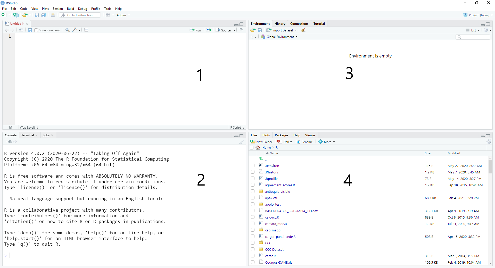
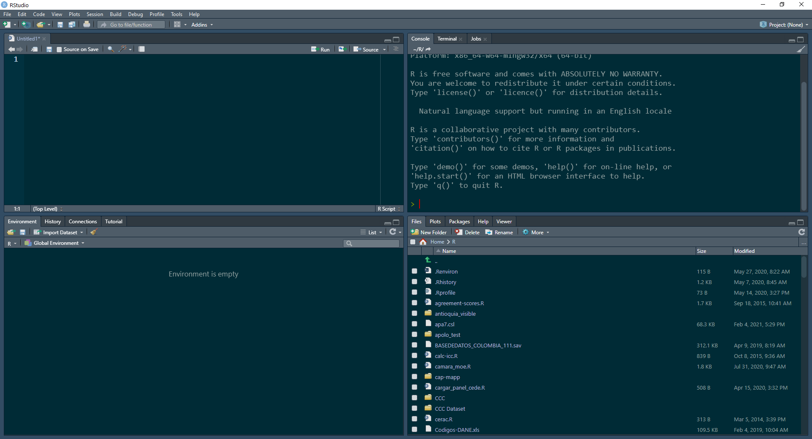
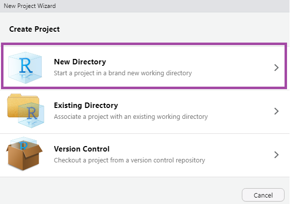
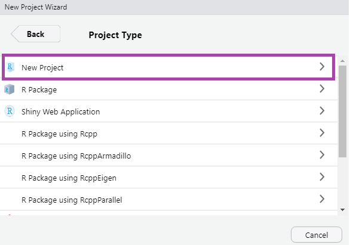
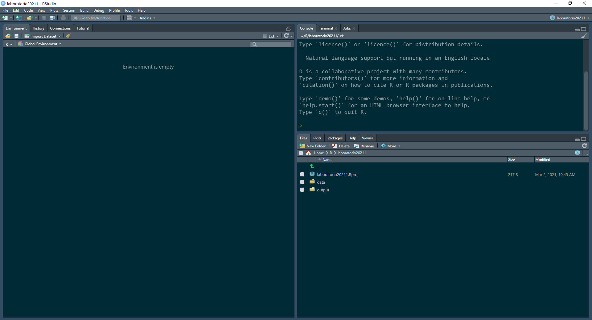

# (PART) Introducción a R y RStudio {-}

# Introducción a R {#cap-intro}

## Resumen

En este capítulo:

- Introducimos R, RStudio y RStudio Cloud, una serie de herramientas para realizar análisis estadístico, y distinguimos las tres.
- Discutimos la diferencia entre trabajar con *scripts* de R (archivos `.R`) y con documentos RMarkdown (`.Rmd`), así como la utilidad de traer librerías adicionales para expandir la funcionalidad de R. 
- Presentamos una serie de problemas frecuentes al usar R, especialmente al inicio del proceso de aprendizaje.

**Principales conceptos**: R; RStudio; RStudio Cloud; script; RMarkdown; proyecto; directorio; librería.

## Hello, world!


```r
print("Hello, world!")
```

```
## [1] "Hello, world!"
```

¡Bienvenidos a R y RStudio! [R](https://www.r-project.org/) es un lenguaje y un programa estadístico. Es de uso libre y cuenta con grandes capacidades para hacer análisis político. Junto con Excel, Stata, SPSS, es uno de las herramientas más populares en las ciencias sociales empíricas.

En el nivel más básico, R es una calculadora. Puede realizar operaciones y aplicar funciones, como por ejemplo, una multiplicación. Simplemente ingresamos una operación con operadores matemáticos (por ejemplo, para multiplicar usamos `*`) en la consola del programa, ejecutamos el código con la tecla `Enter` y R nos arroja el resultado. Por ejemplo, si quiséramos conocer la respuesta al sentido de la vida, el universo y todo lo demás:


```r
6*7
```

```
## [1] 42
```

Usando R, también podemos crear una secuencia de números del 1 al 100, utilizando funciones que el lenguaje reconoce y "lee" correctamente. Por ejemplo, veamos cómo funciona la función `seq()` para crear una secuencia de números:


```r
seq(from = 1, to = 100, by = 1)
```

```
##   [1]   1   2   3   4   5   6   7   8   9  10  11  12  13  14  15  16  17  18
##  [19]  19  20  21  22  23  24  25  26  27  28  29  30  31  32  33  34  35  36
##  [37]  37  38  39  40  41  42  43  44  45  46  47  48  49  50  51  52  53  54
##  [55]  55  56  57  58  59  60  61  62  63  64  65  66  67  68  69  70  71  72
##  [73]  73  74  75  76  77  78  79  80  81  82  83  84  85  86  87  88  89  90
##  [91]  91  92  93  94  95  96  97  98  99 100
```

En ocasiones, si queremos que el resultado de una operación o una línea de código permanezca "en memoria" para poder hacer algo más con este, convertimos los resultados de estas operaciones en objetos de R al asignarles un nombre con el operador de asignación `<-`. Los objetos creados así quedan disponibles hasta que los eliminemos o cerremos la sesión de R. Por ejemplo, podemos guardar la secuencia anterior creando un objeto llamado `secuencia_nums`:


```r
secuencia_nums <- seq(from = 1, to = 50, by = 1)
```

Si queremos ver los contenidos de este objeto, escribimos su nombre en la consola de R:


```r
secuencia_nums
```

```
##  [1]  1  2  3  4  5  6  7  8  9 10 11 12 13 14 15 16 17 18 19 20 21 22 23 24 25
## [26] 26 27 28 29 30 31 32 33 34 35 36 37 38 39 40 41 42 43 44 45 46 47 48 49 50
```

A su vez, estos objetos son sujetos de ser transformados con funciones que les aplican operaciones. Aquí, encontramos la media del objeto `secuencia_nums` usando la función `mean()`:


```r
mean(secuencia_nums)
```

```
## [1] 25.5
```

Podemos guardarlo como un objeto para ver y usar su contenido después:


```r
media_secnums <- mean(secuencia_nums)
media_secnums
```

```
## [1] 25.5
```

Con elementos tan sencillos como estos y otros que veremos más adelante, exploraremos bases de datos y construiremos modelos estadísticos para evaluar teorías y responder preguntas. En el resto de esta introducción, discutimos cómo trabajar con R usando RStudio y su versión web, RStudio Cloud. Nuestro principal objetivo es tener la bases para, más adelante, hacer análisis de datos exploratorio (con gráficas y tablas) y análisis estadístico utilizando regresiones.

### Descargar R

Si queremos utilizar R en nuestros equipos, primero debemos descargarlo e instalarlo. Para descargar el programa, vamos a los siguientes sitios:

-   Para Windows: <https://cran.r-project.org/bin/windows/base/>, click en "Download" o "Descarga".
-   Para Mac: <https://cran.r-project.org/bin/macosx/>, click en el archivo `.pkg`.

Luego, instalan R como cualquier otro programa. La instalación incluye el lenguaje R, así como un editor o interfaz llamado RGui (o simplemente R) para empezar a usar el lenguaje. Sin embargo, en este curso **NO** vamos a trabajar en R usando el editor que viene en esta descarga. En cambio, vamos a facilitar las cosas usando RStudio.

## RStudio

Primero, hay que entender cómo vamos a usar R a través de RStudio. [RStudio](https://rstudio.com/) es una IDE (un *integrated development environment* o entorno de desarrollo integrado) que funciona como una interfaz gráfica de usuario o GUI (*graphical user interface*) para facilitar el uso del lenguaje R y sus capacidades. 

Los elementos centrales del programa RStudio -además de la barra de menús en la parte superior, que comparte con muchos otros programas de computador- son cuatro paneles que vemos en la ventana principal. La siguiente captura de pantalla muestra cómo están organizados los cuatro paneles principales de RStudio:

<div class="figure">

<p class="caption">(\#fig:unnamed-chunk-8)Organización de los paneles en una sesión de RStudio.</p>
</div>

El flujo de trabajo en RStudio sigue lo que hacemos en estos paneles:

1.  Escribimos código, comentarios y texto en el panel del **script** (archivo `.R`) o RMarkdown (archivo `.Rmd`) (panel superior-izquierdo). En una sesión nueva de RStudio, este panel puede no aparecer. Lo activamos creando un archivo tipo R script o RMarkdown nuevo en el menú `File` o abriendo un archivo ya existente.
2.  Ejecutamos (corremos, compilamos...) el código en la **consola** (panel inferior-izquierdo). El símbolo `>` y una línea vacía nos indica que R está listo para ejecutar un comando. Si hay un signo rojo de STOP en la consola, significa que R está activamente trabajando y ejecutando un código; no podemos correr más código en este momento. Además, en la consola vemos los resultados que produce nuestro código. Aquí también creamos objetos de R nuevos al asignarle nombre al resultado de una operación. Ejecutamos código de una de las siguientes maneras:

-   Escribimos código directamente en la consola y presionamos la tecla `Enter`.
-   Copiamos código (de un script, un documento RMarkdown o de otra fuente), lo pegamos en la consola y presionamos `Enter`.
-   Corremos directamente desde el script o RMarkdown usando `Ctrl + Enter` (corre un bloque continuo de código) o seleccionando un pedazo de código con el cursor y luego usando `Ctrl + Enter` (corre solo lo seleccionado). Esta es la opción más recomendada.
-   Hacemos clic en el botón `Run`  del panel del script o RMarkdown, ejecutando un bloque continuo de código.

3.  Frecuentemente creamos *objetos* en R tales como bases de datos, variables, tablas, resultados, etc. Estos aparecen en el `Environment` o **ambiente** de la sesión de RStudio (panel superior-derecho). Hacemos esto ejecutando código en la consola o usando menús y asignándole un nombre al resultado; por ejemplo, una base de datos se puede cargar con código o con el menú `File > Import Dataset`. Todos los objetos que están en el ambiente quedan disponibles para usarse en el código. Podemos borrar *todos* los elementos haciendo clic en `Clear`  o individualmente con la función `rm()`. Los objetos también desaparecen cuando cerramos la sesión, pero podemos guardarlos como archivos para usar después. Así mismo, el script o RMarkdown nos permite volver a construir objetos que hemos eliminado o que han desaparecido porque abrimos una nueva sesión de RStudio. En este panel, hay otras pestañas (`History`, `Connections`, etc.) pero no las usaremos.

4.  Consultamos archivos y directorios (carpetas), gráficas creadas, librerías cargadas o manuales de ayuda integrados en RStudio (panel inferior-derecho). Para esto, están las pestañas `Files` (carpetas y archivos), `Plots` (gráficas), `Help` (manuales) y `Viewer` (vista previa).

Personalmente, ubico el script y el `Environment` (los *inputs*) a la izquierda y la consola y las gráficas (los *outputs*) a la derecha. Además, cambio el color o tema de la interfaz por un fondo oscuro. Mi ventana de RStudio se ve así:

<div class="figure">

<p class="caption">(\#fig:unnamed-chunk-9)Organización alternativa de los paneles en una sesión de RStudio.</p>
</div>

Si quieren realizar cambios como estos, exploren el menú `Tools`, `Global Options`. Si no están seguros la organización que trae RStudio por defecto funciona bien.

Recapitulando: R es un lenguaje de programación estadística y RStudio es una IDE o GUI que facilita el uso de R. Para usar RStudio, debemos primero instalar R. Sin embargo, siempre vamos a trabajar desde RStudio (ya sea en nuestro escritorio o en la web) y no desde R o RGui. 

## RStudio Cloud

[RStudio Cloud](https://rstudio.cloud) es una plataforma web que permite acceder a casi toda la funcionalidad de R y RStudio, pero desde un navegador web. Esto significa que no hay que descargar e instalar programas al computador de escritorio. Igualmente, permite compartir fácilmente código y resultados con colegas, compañeros, profesores y estudiantes. En términos de funcionalidad y "look", RStudio Cloud es casi idéntico a RStudio en el escritorio.

Para utilizar RStudio Cloud, deben crear una cuenta gratis en el [sitio web](https://rstudio.cloud). Esto los lleva a su espacio de trabajo o Workspace o pueden crear uno nuevo. Pueden agregar invitados --sus compañeros de trabajo-- a espacios de trabajo en la pestaña *Members*. 

Para poder empezar a trabajar con R en RStudio Cloud, deben crear un proyecto. La interfaz es bastante intuitiva. En un proyecto, pueden tomar notas de clase, realizar los talleres o llevar a cabo análisis para sus proyectos de investigación. En la siguiente sección, hablaremos de qué son y para qué sirven los proyectos en RStudio.

Unas aclaraciones finales sobre RStudio Cloud. Primero, pese a estar "en la nube", dos usuarios **no** pueden abrir el mismo proyecto de RStudio Cloud al mismo tiempo. Sin embargo, sí pueden crear espacios de trabajo o Workspaces compartidos con otros usuarios, con el fin de colaborar; simplemente deben trabajar de manera secuencial y no simultánea en un mismo proyecto. 

Segundo, las cuentas de Rstudio Cloud tienen un límite mensual de horas/proyecto. Si exceden el límite, podrían quedarse sin recursos a mitad de un proyecto. Por eso, **recomiendo fuertemente usar la versión de escritorio de RStudio descrita en la sección anterior**.

## Proyectos y directorios en RStudio

Para mantener todos nuestros archivos organizados, incluyendo bases de datos que cargamos o gráficas que creamos, vamos a trabajar en lo que RStudio llama "proyectos". Esencialmente, un proyecto de RStudio es una carpeta o directorio de nuestro computador que contiene todos los elementos de nuestro proyecto. Esto incluye archivos de datos, objetos que queremos guardar como archivos y gráficas.

Para crear un nuevo proyecto en RStudio, deben ir a `File`, `New Project...`; ahí deben seleccionar la opción `New Directory`:

<div class="figure">

<p class="caption">(\#fig:unnamed-chunk-10)Cómo crear un nuevo proyecto.</p>
</div>

Después, `New Project`:

<div class="figure">

<p class="caption">(\#fig:unnamed-chunk-11)Cómo crear un nuevo proyecto.</p>
</div>

Y, finalmente, le dan un nombre a su proyecto y le dan `Create Project`:

<div class="figure">

<p class="caption">(\#fig:unnamed-chunk-12)Cómo crear un nuevo proyecto.</p>
</div>

Esto crea automática un archivo tipo `.RProj`  en la carpeta del proyecto. En adelante, podrán abrir este proyecto desde el menú `File`, opción `Open Project...` o navegando a la carpeta del proyecto en sus computadores y abriendo el archivo `.RProj` en cuestión.

Es aconsejable crear subdirectorios (carpetas) para guardar archivos de datos, documentación o gráficas. Podemos crearlos usando el ícono `New Folder`  en la pestaña `Files` del cuadrante inferior derecho de la ventana (el `Environment`).

Para trabajar los inscrutivos de este libro, vamos a crear dos carpetas, llamadas `\data` y `\output` usando el botón `New Folder` . Otra opción es crearlas desde la consola con la función `dir.create()`:


```r
dir.create("data")
dir.create("output")
```

Al final, nuestro proyecto debe verse así:

<div class="figure">

<p class="caption">(\#fig:unnamed-chunk-14)Crear carpetas para guardar datos y resultados.</p>
</div>

### Cargar archivos a RStudio Cloud

A lo largo de instructivo, utilizamos varios archivos de datos para hacer ejercicios y aprender estadística aplicada en R. [Aquí](https://github.com/josefortou/lab-book/tree/master/data) pueden encontrar todos los archivos de datos que utilizamos a lo largo de este instructivo. Para utilizarlos, deben descargarlos a su computador y ubicarlos físicamente (copiar-pegar) en la carpeta `\data` de su proyecto. Cada capítulo de este libro especifica al inicio cuáles archivos se van a utilizar.

Si están trabajando en RStudio Cloud, deben cargar o "subir" estos archivos a la plataforma primero y luego moverlos a la carpeta `/data`. Puedan hacer esto con el botón `Upload`  de la pestaña `Files`; ahí siguen los pasos para hacerlo.

Una vez los archivos estén en la carpeta `/data`, podemos cargar archivos de datos usando el menú `File` o con el botón `Import Dataset`  del panel `Environment`. Si bien utilizar los menús es más fácil e intuitivo al principio, les recomiendo copiar y guardar el código que arroja la carga vía menú para poder replicar el ejercicio más adelante. En este libro, siempre cargamos los datos utilizando código para asegurar replicabilidad de los ejercicios.

Ya que tenemos nuestro proyecto organizado, a continuación veremos en dónde guardamos código para ejecutar, modificar y compartir nuestros análisis.

## Rscripts y RMarkdown

Todo proyecto en R empieza con un documento que contiene el código que vamos a ejecutar. Estos documentos son principalmente de dos tipos: R script o RMarkdown.

### Rscripts

Un script de R (un archivo que termina con la extensión `.R` ) contiene *código* y todo lo que está en el documento será ejecutado como tal. Creamos un nuevo script con `Ctrl + Shift + N` o usando el menú `File`. 

Como señalamos anteriormente, podemos ejecutar líneas o pedazos individuales de código en un script seleccionando lo que queremos ejecutar y presionando `Ctrl + Enter` o el botón `Run` . Copiemos y ejecutemos el siguiente pedazo de código que utiliza la constante $\pi$ para calcular -en tres pasos- el área de un círculo con radio $r = 5$:


```r
radio <- 5
area <- pi*radio^2
area
```

```
## [1] 78.53982
```

Si queremos que alguna parte de un script no sea ejecutada como código, insertamos el símbolo `#` por delante (por ejemplo, `# esto es un comentario`) y todo lo que sigue en esa misma línea queda como marcado comentario, así:


```r
5 + 5 # esto nos da el resultado de la suma
```

```
## [1] 10
```

```r
# 5 + 5 pero esto no
```

Un script de R o su equivalente (por ejemplo, un archivo `.do` en Stata) es un elemento esencial de hacer trabajo cuantitativo, porque nos permite tener un registro de nuestro trabajo, incluyendo resultados, gráficas, experimentos fallidos y, con el uso de comentarios (`#`), un registro de nuestro proceso analítico. Crucialmente, nos permite replicar consistentemente una serie de procedimientos.

### RMarkdown

Un documento RMarkdown (un archivo que termina con la extensión `.Rmd` ) contiene *código y texto*, con el fin de producir un documento final legible tanto por la máquina, como por seres humanos (o sea, no sólo código). En ese sentido, es una mezcla entre un procesador de texto y R. Este libro fue escrito en RMarkdown, utilizando la librería `bookdown`. Creamos un nuevo archivo de RMarkdown usando el menú `File`, `New File`, `RMarkdown...` y siguiendo el asistente. 

El código en un archivo RMarkdown, escrito en R, está organizado en "chunks", o bloques. Estos bloques deben estar delimitados claramente con los caracteres ```` ```{r} ```` y ```` ``` ````. Agregamos bloques a un archivo RMarkdown con el botón  o el atajo `Ctrl + Alt + I`. A continuación, veamos un bloque de código con el código ejecutado, seguido del resultado de la operación:


```r
9^2
```

```
## [1] 81
```

El texto en un RMarkdown usa trucos de un lenguaje llamado Markdown para darle formato a un documento de salida final). Este formato es ideal para realizar informes y talleres o artículos y hasta libros. Puede producir documentos en formato `.html`, `.pdf` y `.docx`. Para crear archivos PDF, RMarkdown requiere tener LaTeX (un programa de composición de textos académicos y técnicos) instalado en el computador (o si usamos la librería `tinytex`). En RStudio Cloud; solo tenemos que instalar librerías de R como `knitr` y `rmarkdown`. Pronto hablaremos sobre librerías.

#### YAML

Todos los documentos RMarkdown deben empezar con un encabezado tipo YAML, delimitado por guiones (`---` antes y después), que contiene información como título, autor, fecha y el tipo de archivo de salida deseado (HTML, PDF o Word, entre otros). Un ejemplo minimalista de un YAML es el siguiente:

    ---
    title: "Introducción"
    author: "Fortou"
    output: html_document
    ---

Cuando creamos un nuevo RMarkdown en RStudio (`File > New file > RMarkdown` o haciendo clic en el ícono ) podemos seleccionar el tipo de *output* deseado y al mismo tiempo llenar los campos básicos del YAML (las opciones `title:`, `author:` y `output:`). Es posible personalizar el YAML y así cambiar el "look" del producto de un RMarkdown, pero por el momento, trabajaremos con las opciones básicas.

#### Ejecutar código

En RMarkdown también podemos ejecutar código de distintas maneras:

-   Líneas de código individuales con `Ctrl + Enter` (debemos hacer click en la línea que queremos ejecutar).
-   Bloques de código específicos haciendo clic en el icono de "play" en cada bloque (`Run current chunk` ).
-   Usando las opciones del menú `Run`  en el panel del archivo RMarkdown.
-   Usando `Run all chunks above` , con esta opción, RStudio ejecuta todos los bloques anteriores.

Los resultados aparecen en la consola o directamente en el panel del archivo `.Rmd` (otra de las ventajas de usar RStudio).

#### "Tejer" un RMarkdown

Para obtener un archivo tipo HTML o PDF con texto, código y resultados, debemos compilar el archivo RMarkdown completo. Cuando ejecutamos un archivo RMarkdown completo, o sea cuando lo "tejemos" o compilamos con el botón `Knit` , RStudio lee y ejecuta todo lo que hay en el documento, incluyendo código y texto y crea un nuevo archivo según el output especificado en el encabezado YAML. La primera vez que tejemos un RMarkdown, RStudio nos pregunta si queremos instalar unas librerías; debemos hacerlo para poder utilizar estos archivos.

Un RMarkdown solo compila exitosamente si no hay errores en el código y en el texto. A veces puede ser frustrante no encontrar un error persistente, pero esto es parte del proceso de aprendizaje de cualquier lenguaje de programación. Sin embargo, hay unos lineamientos básicos. Por ejemplo:

- Es necesario que el código esté en orden cronológico: no podemos calcular en la línea 5 una media de unos datos que solamente cargamos después, en la línea 10 o en un bloque de código posterior. 
- En los bloques de código solo debe haber código. Si hay texto, debe ir precedido de un `#` para marcarlo como comentario. Mientras, en el cuerpo del documento solo debe haber texto (si hay código, no se ejecutará como tal).
- Es clave y altamente recomendable cargar todas las librerías que vamos a utilizar al inicio del archivo, en un código dedicado a esto como el siguiente:


```r
library(tidyverse) # no ejecutar, a menos que ya este instalada
# ya vamos a hablar sobre librerias...
```

Si todo compila correctamente, R produce un documento en el formato que indicamos en el encabezado YAML del documento (por ejemplo, `output: pdf_document` produce un archivo `.pdf` , `output: word_document` produce un `.docx` para Word ). Por ejemplo, este libro está escrito en RMarkdown y produce un archivo `.html`   que se puede utilizar en una página Web. El texto aparece como esperaríamos que aparezca: como texto que podemos formatear si usamos trucos de Markdown. Mientras, el código aparece en cuadros resaltados y los resultados del código -tablas, gráficas, resúmenes, etc.- aparecen en el documento final. 

El documento creado por RMarkdown aparece en la misma carpeta donde está guardado el archivo `.Rmd`. Este documento es auto-contenido, así que lo podemos compartir a otras personas para que vean nuestros proceso, sin tener que descargar programas o ejecutar el código ellos mismos. **Así deben entregar los talleres de clase**.

Finalmente, cada bloque de código tiene opciones sobre qué queremos ejecutar y mostrar. Podemos ver las opciones en el botón  en cada bloque de código. Por ejemplo, `eval = FALSE` si queremos que el código allí no sea evaluado o ejecutado el tejer el archivo, pero queremos mostrar el código:


```r
10*10
```

O, al revés, con `echo = FALSE`, vemos el resultado pero no el código, ideal para tablar, gráficos, limpieza de datos, etc. y la elaboración de artículos académicos o informes:


```
## [1] 100
```

#### Visual Markdown Editor

A partir de la versión 1.4.1103 de RStudio, es posible trabajar en un archivo de RMarkdown más parecido a Word u otros procesadores de texto. ¡Incluso incluye integración con el software de referencias bibliográficas Zotero! Para pasar al modo "Visual Markdown Editor" pueden hacer click en el ícono  en la ventana del documento RMarkdown actual. En este sitio pueden aprender más sobre este modo: https://rstudio.github.io/visual-markdown-editing/#/.

### Guardar

Con frecuencia, utilizamos ambos tipos de archivos: R scripts usualmente para análisis exploratorio "interno" y RMarkdown para entregas o documentos que queremos compartir con otros (pero pueden usar RMarkdown para todo). Sean scripts o documentos de RMarkdown, ¡recuerden guardar el archivo  para no perder sus avances!

## Librerías

En R hacemos cosas usando funciones, objetos que le aplican operaciones a otros objetos. En otras palabras, una función toma un *input*, le aplica una operación y produce un *output*. Por ejemplo, si `x` es un objeto en R, `f(x)` aplica la función `f()` al objeto `x`. Si la función `f()` está definida como `f <- function(x){x^2}` (recordemos que en R, definimos algo al asignarle un nombre con `<-`, lo cual crea un objeto), entonces `f(x)` toma `x` y lo eleva al cuadrado (`^2`). En R, este proceso se ve así:


```r
# Definimos la funcion
f <- function(x){x^2}
# Definimos x
x <- 9
# Aplicamos la funcion f a x
f(x)
```

```
## [1] 81
```

No tenemos que escribir y definir nosotros mismos todas las funciones que queremos utilizar. Por ejemplo, la función `mean()` ya existe en R; sirve para encontrar la media aritmética de un conjunto de datos numéricos. El código del siguiente bloque calcula la media del conjunto de números del 1 al 100:


```r
mean(1:100)
```

```
## [1] 50.5
```

Las funciones toman *argumentos*. Por ejemplo, como acabamos de ver, la función `mean()` toma como primer argumento (*input*) unos datos numéricos, calcula la media (le aplica una operación) y la imprime en la consola (*output*).

Las funciones pueden tomar argumentos adicionales. Podemos pensar en estos argumentos como opciones. Por ejemplo, si queremos hallar la media de un conjunto de datos que contiene un valor no disponible --designado en R como `NA`, debemos especificarlo en la función `mean()` utilizando el argumento `na.rm = TRUE`. Comparemos qué sucede cuando hacemos esto y cuando no lo hacemos:


```r
# un vector de notas de clase
y <- c(30, 35, 35, 50, NA, 25, 35, 45, 40, 25)
# sin na.rm = TRUE
mean(y)
```

```
## [1] NA
```

```r
# con na.rm = TRUE
mean(y, na.rm = TRUE)
```

```
## [1] 35.55556
```

Si no incluimos `na.rm = TRUE` y los datos tienen un valor `NA`, la función `mean()` nos devuelve `NA`; por defecto, la función asume que `na.rm = FALSE`. Pero si especificamos el argumento, recibimos el producto esperado.

Hay muchas otras funciones en R (cada una con sus propios argumentos), tales como `data.frame()`, `head()`, `lm()`, `tibble()` y `ggplot()` que veremos a lo largo de este libro. Casi todo lo que hacemos en R es a través de funciones.[^intro-1] Muchas de estas vienen incluidas en R, como `mean()`. En ese caso, decimos que son parte de "R base" porque están incluidas en la librería `base` que viene preinstalada y precargada). 

[^intro-1]: Otras cosas las hacemos con operadores matemáticos (como `*` y `+`) y lógicos (como `&` y `==`).

Pero otras funciones vienen de librerías adicionales. Las librerías son colecciones de funciones y expanden lo que podemos hacer en R. En el espíritu colaborativo de R -al fin y al cabo, es un programa gratis-, los autores de estas librerías son usuarios de R, muchos de ellos profesionales de la estadística, la ciencia de los datos y las ciencias sociales. Para usar las funciones de una librería existente[^intro-2], es necesario seguir dos pasos:

[^intro-2]: La lista completa de todas librerías actualmente disponible está en el repositorio [CRAN](https://cran.r-project.org/). Además, podemos instalar y utilizar otras que se encuentran en el portal [GitHub](https://www.github.com/).

1.  Descargar e instalar la librería usando `install.packages("nombre_libreria")` **una sola vez** por computador o por proyecto en RStudio Cloud. Es un proceso automático y lo podemos hacer en el menú `Tools`, opción `Install packages` . 
2.  Cargar la librería a la sesión actual de R ejecutando el comando `library(nombre_libreria)` **cada vez** que abrimos una sesión nueva de RStudio o RStudio Cloud.

La "metalibrería" [`tidyverse`](https://www.tidyverse.org/) incluye varias librerías. Cuando la instalamos, R instala las siguientes librerías: `ggplot2`, `dplyr`, `tidyr`, `readr`, `purrr`, `tibble`, `stringr`, `forcats`, `readxl`, `haven`, `jsonlite`, `xml2`, `httr`, `rvest`, `DBI`, `lubridate`, `hms`, `blob`, `magrittr` y `glue`. Cuando la cargamos a la sesión de R, solamente carga las más usadas:

-   `ggplot2`: crear gráficas.
-   `dplyr`: transformar con datos.
-   `tidyr`: ordenar datos.
-   `readr`: cargar archivos con bases de datos.
-   `purrr`: aplicar funciones.
-   `tibble`: crear bases de datos.
-   `stringr`: trabajar con datos de tipo texto.
-   `forcats`: trabajar con factores o variables categóricas.

Vamos a instalar `tidyverse`, pues usaremos estas librerías a lo largo de los instructivos de este libro. Para esto, escribimos y ejecutamos la siguiente línea de código (se demora un par de minutos, pues contiene muchas librerías):


```r
install.packages("tidyverse")
```

Si quieren, pueden revisar si está instalada:


```r
"tidyverse" %in% rownames(installed.packages())
```

Una vez instalada, podemos cargarla a la sesión actual de R:


```r
library(tidyverse)
```

```
## Warning: package 'tidyverse' was built under R version 4.0.3
```

```
## Warning: package 'tibble' was built under R version 4.0.3
```

```
## Warning: package 'dplyr' was built under R version 4.0.3
```

Ahora, podemos usar funciones de estas librerías, como `filter()`, que sirve para filtrar bases de datos. En este caso, vamos a revisar unos datos que vienen con `tidyverse` para ver la lista de personajes de *Star Wars* que son androides:


```r
# filter() realiza un subconjunto de datos
# veamos los personajes de Star Wars que son de la especie "Droid"
starwars %>%
  filter(species == "Droid")
```

```
## # A tibble: 6 x 14
##   name   height  mass hair_color skin_color  eye_color birth_year sex   gender  
##   <chr>   <int> <dbl> <chr>      <chr>       <chr>          <dbl> <chr> <chr>   
## 1 C-3PO     167    75 <NA>       gold        yellow           112 none  masculi~
## 2 R2-D2      96    32 <NA>       white, blue red               33 none  masculi~
## 3 R5-D4      97    32 <NA>       white, red  red               NA none  masculi~
## 4 IG-88     200   140 none       metal       red               15 none  masculi~
## 5 R4-P17     96    NA none       silver, red red, blue         NA none  feminine
## 6 BB8        NA    NA none       none        black             NA none  masculi~
## # ... with 5 more variables: homeworld <chr>, species <chr>, films <list>,
## #   vehicles <list>, starships <list>
```

Al principio de cada capítulo de este instructivo, encuentran la lista de librerías que se utilizan en el capítulo. Recuerden revisar primero que estén instaladas en el proyecto y luego cargarlas a la sesión con `library()`.

## Errores comunes en R y RMarkdown

R puede tener una curva de aprendizaje empinada. Con frecuencia, nos chocamos de frente con código que no corre o no hace lo que queremos y R nos hace saber que estamos cometiendo un error. Vale aclarar que hay una diferencia entre advertencias ("warnings") y errores ("errors"). R corre código y produce resultados pese a que haya advertencias (aunque el producto puede que no sea lo que esperábamos...), pero no lo hará cuando hay errores.

Si R les dice que hay un error, hay un error. La descripción del error aparece en la consola. Estas descripciones pueden ser crípticas, pero intenten buscarlas en Google - ¡seguro no son los primeros en encontrarse con un error en particular! [StackOverflow](https://stackoverflow.com/) es un gran recurso y muchos resultados de Google nos llevarán allá.

Finalmente, en la consola, pueden ejecutar `?` seguido del nombre de la función que provocó el error para abrir el manual de usuario de la función. Por ejemplo, si queremos saber cómo utilizar la función `mean()` para hayar una media:


```r
?mean
```

RStudio avisa con una $\times$ roja en la margen izquierda del script o RMarkdown si hay un error de sintaxis en el código (por ejemplo, si falta un paréntesis o unas comillas) incluso antes de que lo corran. No es infalible, pero ayuda.

La principal fuente de errores en R son errores de tipografía; básicamente, escribir algo mal, como el nombre de un archivo, una función o de otro objeto. R es sensible a las mayúsculas, a los acentos y otros caracteres especiales y a la puntuación, así que debemos revisar bien que estamos escribiendo `View()` y no `view()` o `mis_datos` en vez de `MIS_DATOS`.

Otro error común es olvidar cerrar los paréntesis o comillas. Por ejemplo, `print(“Hello, world!` (sin comillas ni paréntesis de cierre) hace que R crea que el comando aún no está terminado. En este último caso, la última línea de la consola mostrará un símbolo `+` en vez del `>` habitual. Cancelen esto con la tecla `Esc` directamente en la consola y revisen el código antes de seguir.

En líneas generales, los mensajes de error frecuentemente tienen tres partes. Por ejemplo, correr `mean(z)` sin haber definido `z` previamente arroja el mensaje: `“Error in mean(z) : object 'z' not found”`. Por partes, esto nos dice que:

-   "`Error in`" avisa que este mensaje señala un error.
-   "`mean(z)`" es el pedazo de código o la función donde está el error.
-   "`: object ‘z’ not found`" es el problema encontrado.

Hay una serie de errores frecuentes que todos los usuarios de R (novatos y veteranos) experimentan en su momento:

-   `Error in eval` y `object not found`: suceden con frecuencia cuando estamos referenciando algo que no existe. Puede ser que hayamos escrito mal su nombre o que nunca lo hayamos creado como un objeto (utilizando el operador de asignación `<-`). Revisen la pestaña `Environment`: al hacer clic en el ícono  pueden además explorar todos los objetos cargados por las librerías en uso.
-   `Unexpected ‘)’ in...`: tienen demasiados paréntesis mean(x)).
-   `Unexpected constant in...` o `unexpected symbol in...`: se nos olvidó una coma o unas comillas. Por ejemplo, `rnorm(n = 100 mean = 5)` arroja un error porque falta una coma entre el argumento `n` y el argumento `mean` de la función `rnorm()`.
-   `Could not find function...`: no hemos cargado la librería que incluye la función que queremos usar o no la hemos definido nosotros mismos.
-   `Cannot open the connection...`, `cannot find...`, `cannot open...` y `...does not exist in current working directory`: intentamos cargar un archivo de datos que no existe en el directorio (carpeta) o que no existe bajo ese nombre. Revisen que efectivamente está en el directorio y confirmen el nombre del archivo.
-   `Object of type 'closure' is not subsettable`: estamos tratando una función como si fuera una lista, vector o marco de datos (por ejemplo, si intentamos ejecutar mean\$x). Este es el ["PC Load Letter"](https://www.youtube.com/watch?v=5QQdNbvSGok) del mundo de R.
-   `No applicable method for...`: estamos intentando aplicar una función a un tipo de objeto que no deberíamos.
-   `Argument "no" is missing, with no default` y `argument "False" is missing, with no default`: estamos usando una función como `if_else()` sin darle la segunda condición (si esto, aquello, sino lo otro).

Cerramos brevemente con otras cosas importantes para tener en cuenta a la hora de "tejer" un archivo RMarkdown para producir un informe:

-   A veces copiamos código de un R script o de la consola a un RMarkdown. En esos caso, hay que tener cuidado de no pegar resultados de la consola o elementos como `>` (indica que R está listo para ejecutar un comando) y `+` (indica que R cree que el último pedazo de código continúa en la siguiente línea), porque arrojan errores. Revisen bien que tienen en sus bloques de código.
-   Debemos cargar todas las librerías que utilizamos en el script y en orden cronológico (o sea, cargar la librería en una línea o bloque previo a donde usamos las funciones de la misma). Como ya mencionamos, las librerías deben estar instaladas en el computador o en el workspace de RStudio Cloud. Es recomendable cargar todas las librerías a utilizar en un bloque al inicio del `.Rmd`.
-   Si cargamos un archivo de datos, este debe existir en un directorio y debemos asegurarnos que lo estamos llamando por su nombre exacto, sin errores tipográficos y con la extensión apropiada.
-   Si notamos que RMarkdown no evaluó como código algo que debía ser código, sino como texto normal, revisemos que abrimos y cerramos el bloque de código apropiadamente con ```` ```{r} ```` y ```` ``` ````.
-   Si no aparece el botón de `Knit` , debemos asegurarnos que el archivo tiene extensión .Rmd (y no `.R` o `.txt`).

## Recursos

Hay infinidad de recursos para R en la web. Algunos para las etapas iniciales, son:

-   Recursos de RStudio y RMarkdown:

    -   Sitio principal de RMarkdown: <https://rmarkdown.rstudio.com/>
    -   Cheat sheet (hoja de referencia) para RMarkdown en español: <https://resources.rstudio.com/espanol/rmarkdown-spanish>
    -   Guía de referencia para RMarkdown: <https://www.rstudio.com/wp-content/uploads/2015/03/rmarkdown-reference.pdf>
    -   Materiales de estudio en español: <https://resources.rstudio.com/espanol>
    -   Materiales de estudio en inglés (más variedad): <https://resources.rstudio.com/>
    -   Ejercicios aplicados para aprender: <https://rstudio.cloud/learn/primers>
    -   Algunos tips sobre R and RMarkdown: <https://drive.google.com/file/d/1W8NxN-lfHvDHHJWMBYd8qXQUqefP6Ek_/view>
    -   Videos sobre cómo instalar R y RStudio en distintos sistemas operativos: <https://www.youtube.com/playlist?list=PLRPB0ZzEYegOZivdelOuEn-R-XUN-DOjd>

-   Solución de problemas en general sobre R:

    -   R-bloggers: <https://www.r-bloggers.com/>
    -   StackOverflow: <https://stackoverflow.com/questions/>

-   Libros gratis sobre R, RStudio y RMarkdown:

    -   R Ciencias de Datos: <https://es.r4ds.hadley.nz/>
    -   RMarkdown: The Definitive Guide: <https://bookdown.org/yihui/rmarkdown/>
    -   Quantitative Politics with R: <http://qpolr.com/>

## Ejercicios

1. Descargar e instalar R y RStudio en sus computadores; en caso de que no puedan, crear una cuenta en RStudio Cloud.

2. Crear un proyecto de RStudio -puede llamarse "Laboratorio" o algo similar- con dos carpetas: `\data` y `\output`. Este será el proyecto donde trabajarán los instructivos el resto del semestre. 
  + Opcional: crear un proyecto de RStudio adicional para la investigación del curso.

3. Instalar la librería `tidyverse` en RStudio.

4. Crear un nuevo archivo de RMarkdown, guardarlo y ejecutar una multiplicación (cualquiera) en un bloque de código.

5. "Tejer" el archivo RMarkdown a un `.html`.
